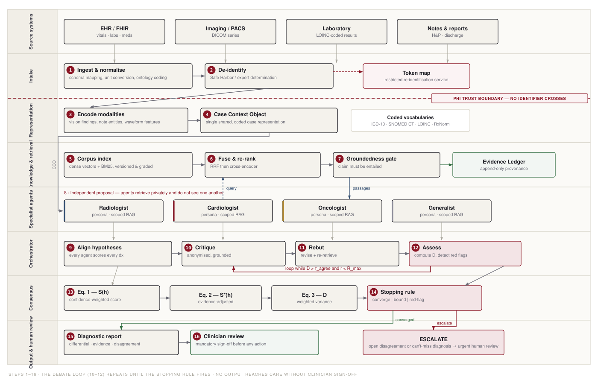

# MedJar

**Consensus diagnosis by debating specialist agents.**

Persona-conditioned language-model specialists (radiologist, cardiologist, oncologist,
generalist) reason independently over a patient case, ground every claim in retrieved
literature, and are driven toward a calibrated, auditable diagnosis through structured
debate — escalating to a clinician when they cannot reconcile or when a can't-miss
diagnosis is in play.

> **Research prototype.** Evaluated on three *synthetic* cases with a deterministic
> reasoner. Not a medical device, not validated for care, and it produces no clinical
> advice. Reported numbers characterise the system's mechanics, not diagnostic
> performance.

---

## Contents

| Path | What it is |
|---|---|
| **[`PAPER.md`](PAPER.md)** | The technical report — architecture, formalism, evaluation, and all 14 figures. **Start here.** |
| **[`presentation.html`](presentation.html)** | 30-slide seminar deck with every figure inlined. Self-contained: open it in any browser, works offline. |
| **[`MedJar.pptx`](MedJar.pptx)** | 28-slide PowerPoint (text-only companion; the figures live in `figures/`). |
| **[`figures/`](figures/)** | 14 vector figures + the generator that produces them. See [`figures/README.md`](figures/README.md) for the index. |
| **[`prototype/`](prototype/)** | The runnable system, including the LLM adapters. |
| **[`prototype/output/`](prototype/output/)** | Generated diagnostic reports, debate transcripts, and `trace.json`. |
| **[`index.html`](index.html)** | Landing page — published at [zyaanop.github.io/ppt/medjar/](https://zyaanop.github.io/ppt/medjar/). |

## The system in one figure



Steps 1–16. De-identification happens in the intake lane — nothing below the boundary
carries a patient identifier. Agents retrieve privately and never observe one another
during proposal. The debate loop (10–12) repeats while disagreement exceeds threshold
and the round budget holds. Both dispositions terminate in mandatory clinician sign-off.

## Reproducing everything

Requires **Python 3.9+ only** — no dependencies, no network, fully deterministic.

```bash
cd prototype  && python3 run_demo.py       # run the system; writes output/ + trace.json
                 python3 verify_llm_path.py# exercise the LLM path offline (19 checks)
cd ../figures && python3 make_figures.py   # regenerate all 14 figures from that trace
                 python3 check_layout.py   # geometric validation of the figures
cd ..         && python3 build_deck.py     # rebuild presentation.html (inlines the SVGs)
                 python3 build_pptx.py     # rebuild MedJar.pptx
```

Result figures are computed from `prototype/output/trace.json`, so the paper's numbers
and its plots cannot drift apart.

## Running the specialists on a real model

The reported results use the deterministic rule engine so they are reproducible. To
put actual language models behind the four personas, inject an adapter — nothing else
in the pipeline changes:

```bash
OPENAI_API_KEY=…    python3 run_demo.py --engine llm --provider openai --model gpt-4o-mini
ANTHROPIC_API_KEY=… python3 run_demo.py --engine llm --provider anthropic
                    python3 run_demo.py --engine llm --provider ollama --model llama3.1
python3 run_demo.py --engine llm --base-url http://localhost:8000/v1 --model my-model
```

Adapters cover any OpenAI-compatible `/chat/completions` endpoint, Anthropic
`/v1/messages`, and local servers — all over `urllib`, so there are still no
dependencies. Personas live in [`prototype/medjar/personas.py`](prototype/medjar/personas.py).

Three things are enforced in code rather than trusted to the model:

- **Citations must be real.** A `citation_id` the model was never offered is discarded,
  so a hallucinated reference cannot reach the Evidence Ledger.
- **Failure is not silence.** A malformed reply costs one agent its turn; a
  *configuration* failure raises immediately, and if the ensemble yields no hypothesis
  at all the orchestrator refuses to report and escalates. An empty differential must
  never read as a negative finding — `run_demo.py` exits non-zero.
- **Competence still gates critique.** A prior exists only if the model actually
  reasoned about that diagnosis, or it is in the agent's own domain — so the safety
  rule below survives the swap to LLMs.

> **Note:** the LLM path is verified structurally by `verify_llm_path.py`, which
> substitutes a scripted adapter for the provider and checks all of the above. No live
> provider call was made in preparing this repository.

## What the prototype does

Three synthetic cases, exercising all three stopping paths:

| Case | Reference diagnosis | Leading `S*` | Rounds | Disposition |
|---|---|---|---|---|
| CASE-001 | Primary lung malignancy | 0.79 ✓ | 4 | **escalated** — can't-miss |
| CASE-002 | Benign pulmonary granuloma | 0.59 ✓ | 2 | **converged** |
| CASE-003 | Acute coronary syndrome | 0.55 ✓ | 1 | **escalated** — can't-miss |

Top-1 3/3 · Top-3 3/3 · 130/130 claims passed the groundedness gate · 91 ledger
citations · **ECE 0.243** (poor — reported as a negative result: the aggregation
weights are hand-set, not fitted).

## Design in brief

- **Grounding.** Hybrid dense + BM25 retrieval, reciprocal-rank fusion, cross-encoder
  re-ranking, then a hard gate: a claim not entailed by its cited passage is excluded
  from aggregation. Survivors are written to an append-only Evidence Ledger.
- **Debate.** `propose → critique → rebut → assess`. Proposal is isolated to prevent
  anchoring; critique is anonymised; contested points seed targeted re-retrieval.
- **Consensus.** Confidence- and competence-weighted aggregation (Eq. 1), an evidence
  adjustment (Eq. 2), and a disagreement metric (Eq. 3) that drives the stopping rule.
- **Escalation.** Unresolved disagreement or any can't-miss diagnosis above threshold
  routes to a human, with the open question stated. The override is asymmetric: it can
  force escalation, never suppress it.

## The result worth reading

§6.4 of the paper documents four failure modes the implementation exposed. The most
important:

> **Incompetent critique → false reassurance.** Agents holding no prior for a diagnosis
> were initially allowed to raise "overcall" critiques using their own ignorance-floor
> as the comparison. Three agents with no cardiology competence drove a *correct* acute
> coronary syndrome diagnosis from `S*` 0.84 to 0.27 — below the escalation threshold —
> and the case converged instead of escalating, manufacturing exactly the false
> reassurance the system exists to prevent.

The fix is to tie the right to object to competence. The general lesson:
**aggregation rules, not agent count, determine whether an ensemble is safe.** An
unweighted debate among heterogeneous agents can be *more* dangerous than a single
competent agent, because it gives confident non-experts a mechanism to overrule a
correct specialist.

## Viewing the deck

Download [`presentation.html`](presentation.html) and open it — no server needed.
`←` `→` or click to navigate, `A` to auto-advance, `F` for fullscreen, `Home`/`End` to
jump. Deep-links via `#s12`.

---

*Decision support only. A licensed clinician remains the decision-maker and is
accountable for care.*
