# MedJar — figure set

Vector figures generated by `make_figures.py`. Structural figures are drawn from the system specification; result figures are computed from `../prototype/output/trace.json`, so they cannot drift from the prototype's actual behaviour.

### Figure 1 — Layered system architecture.

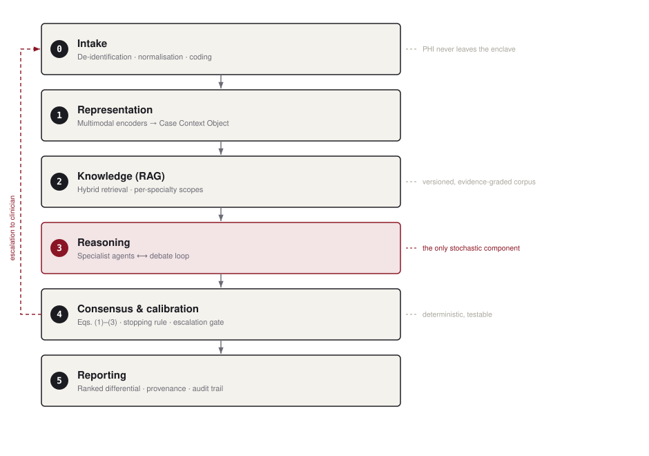

### Figure 2 — End-to-end workflow across trust boundaries and layers (steps 1–16).

### Figure 3 — Hybrid retrieval, fusion, re-ranking and the groundedness gate.

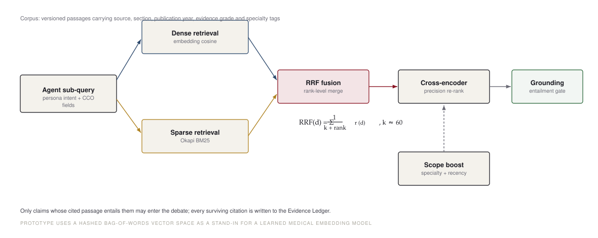

### Figure 4 — Debate protocol as a message sequence.

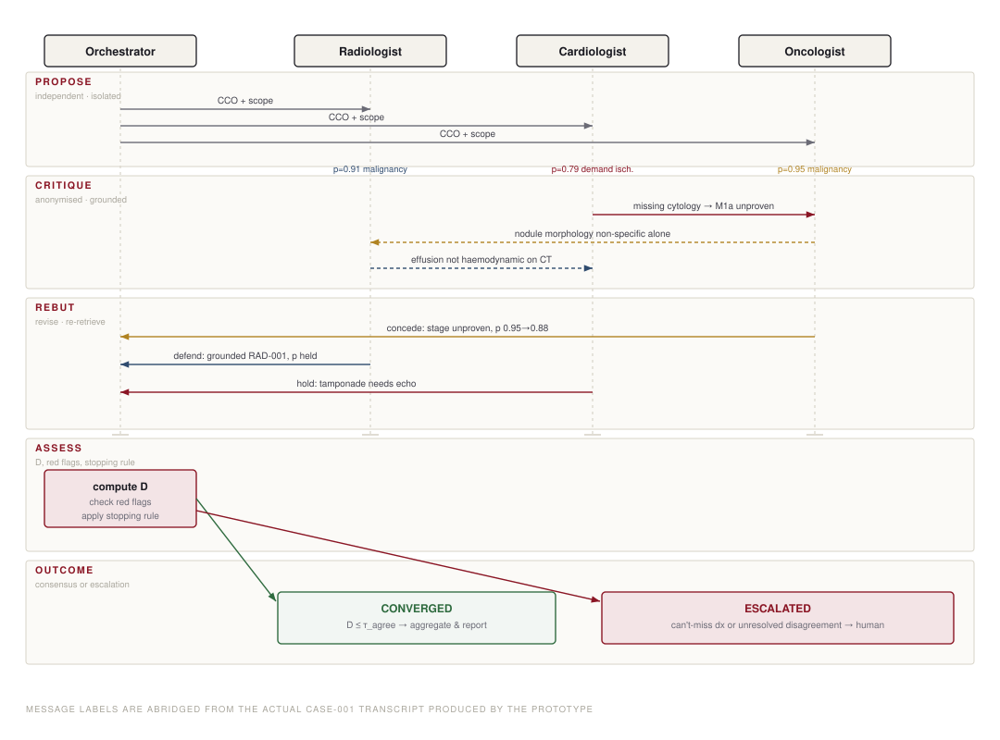

### Figure 5 — Orchestrator finite-state machine with guards.

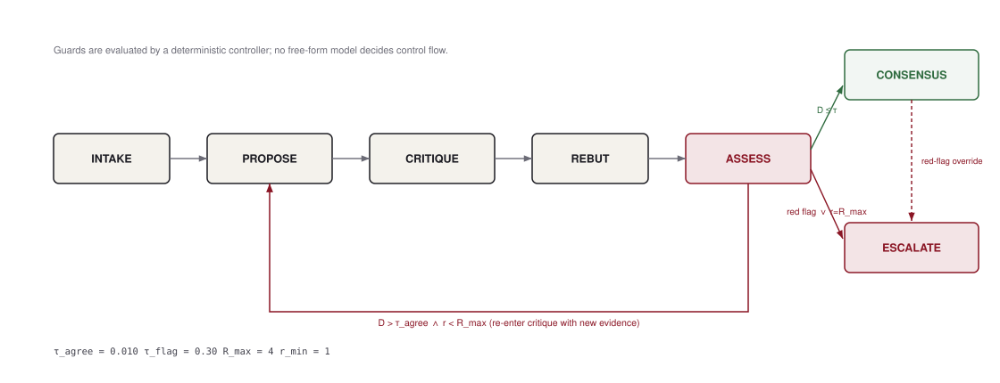

### Figure 6 — How agent opinions become S*(h) and D̄.

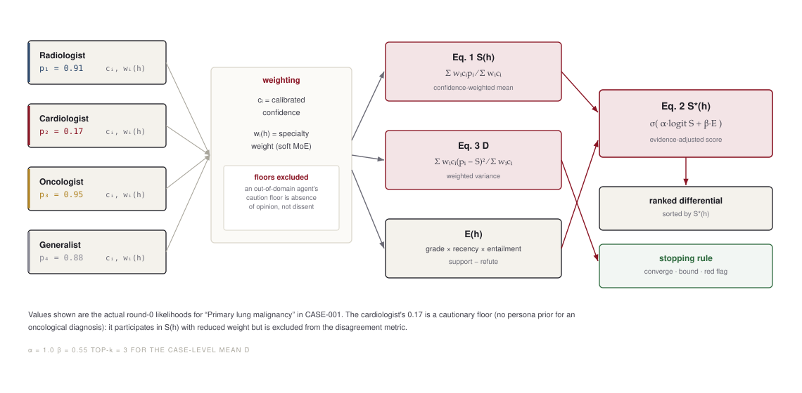

### Figure 7 — Multimodal intake normalised into the Case Context Object.

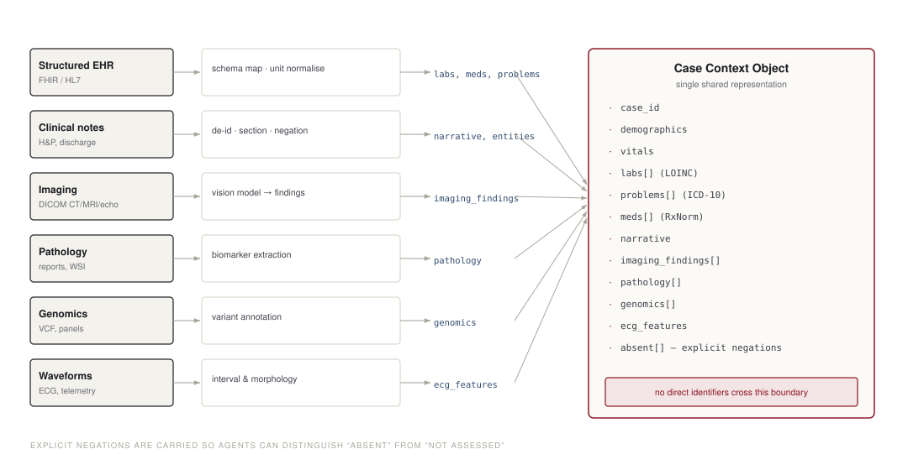

### Figure 8 — Anatomy of the unified diagnostic report.

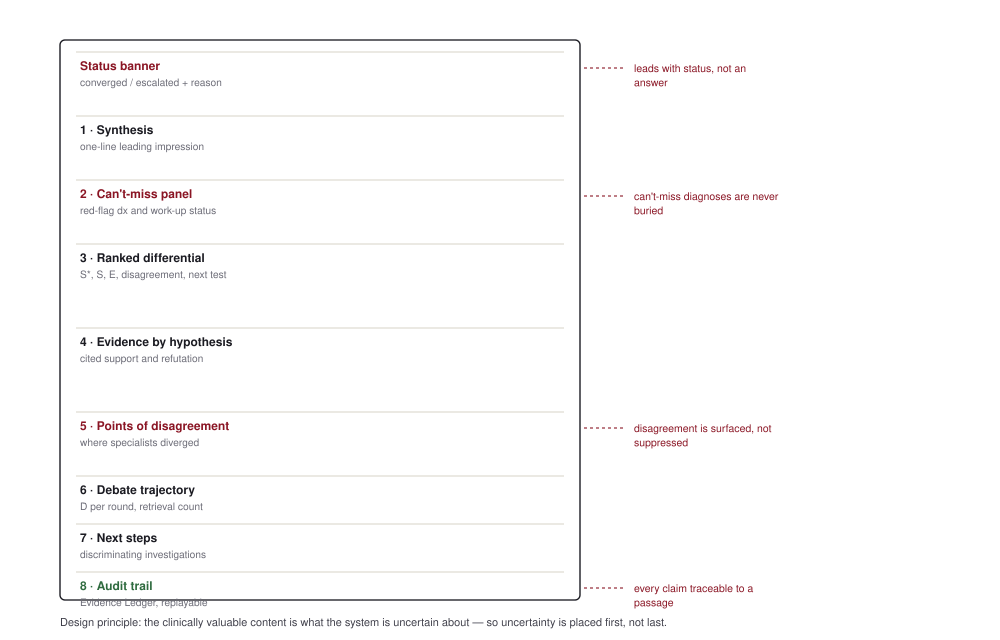

### Figure 9 — Deployment topology and trust boundaries.

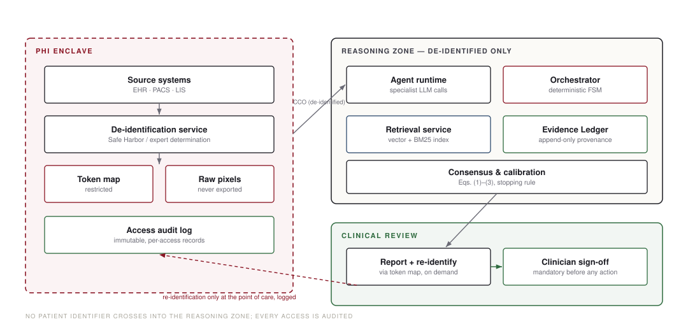

### Figure 10 — Disagreement trajectories: convergence versus escalation.

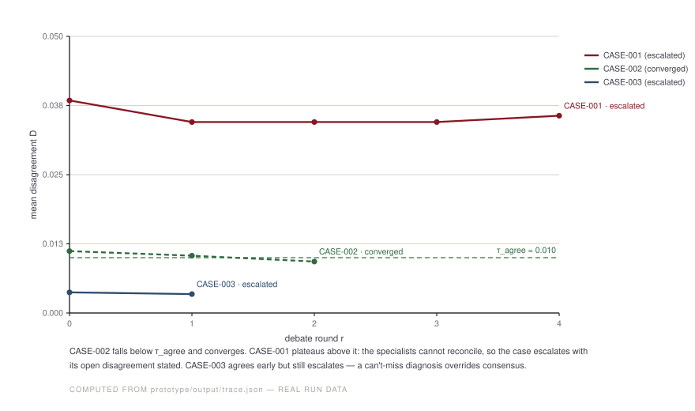

### Figure 11 — Cross-specialty divergence on CASE-001 hypotheses.

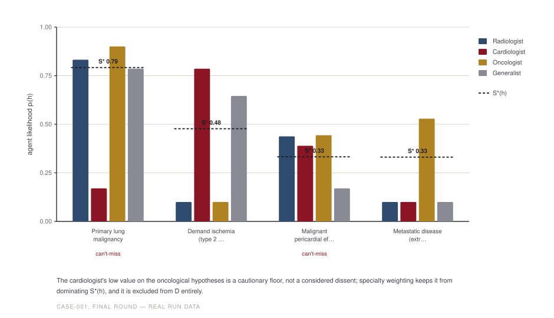

### Figure 12 — Ranked differential for CASE-001 with evidence adjustment.

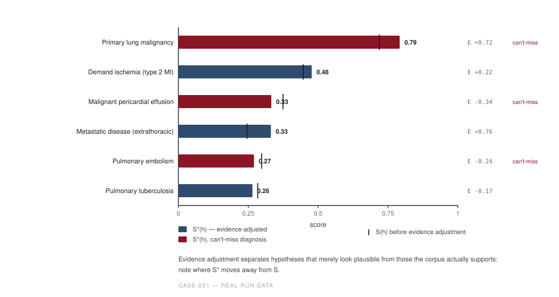

### Figure 13 — Reliability diagram and run summary.

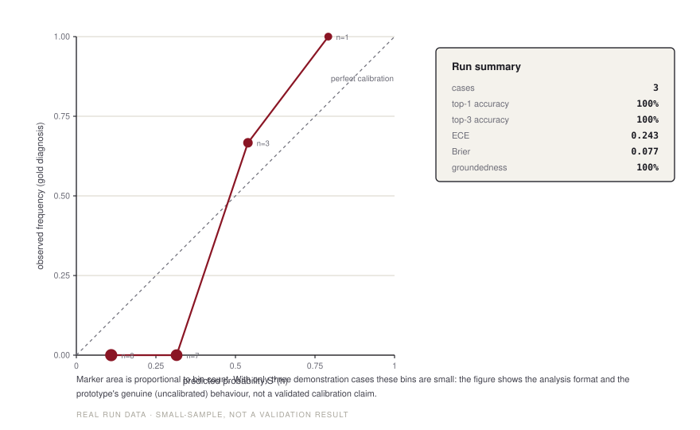

### Figure 14 — Planned ablation (illustrative).

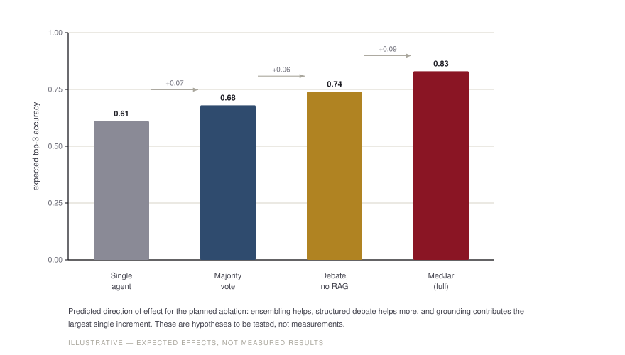
